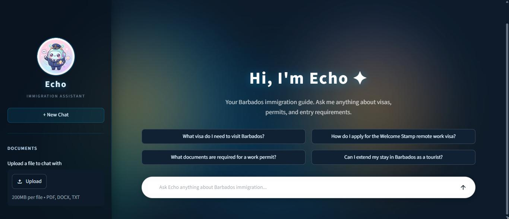
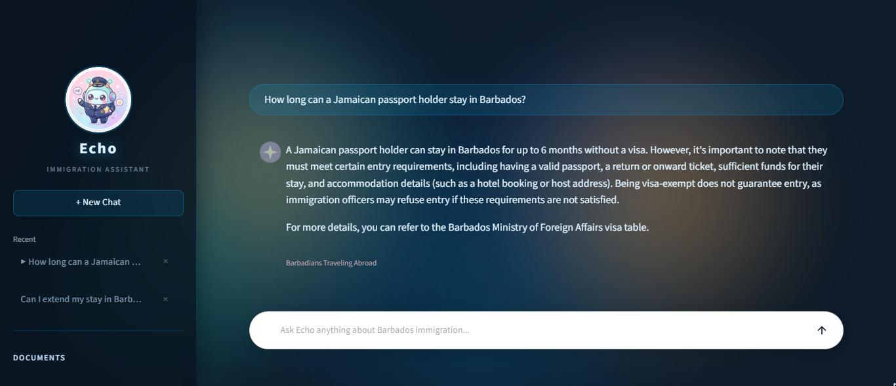

# Echo — Barbados Immigration Assistant

Echo is an AI-powered RAG (Retrieval-Augmented Generation) chatbot that answers questions about Barbados immigration. It uses OpenAI for chat completions and embeddings, FAISS for vector search, and Streamlit for the UI.

The knowledge base is built from official Barbados government immigration pages, a structured visa requirements document, and a plain-language immigration guide.



*Echo answering a question, with the knowledge base sources it drew from shown beneath the response:*



---

## Features

- Answers questions about visas, work permits, the Welcome Stamp, student visas, extensions of stay, citizenship, and passports
- Retrieves relevant context from a pre-built FAISS index of official immigration content
- Four function-calling tools: keyword page search, full-page retrieval by topic, visa requirement lookup by nationality, and current date lookup
- Supports user file uploads (PDF, DOCX, TXT) as a supplementary knowledge source
- Conversation history with multi-session support via the sidebar

---

## Prerequisites

- Python 3.11 or higher
- An OpenAI API key

---

## Setup

**1. Clone the repository**

```bash
git clone <your-repo-url>
cd ai-chatbot-rag
```

**2. Create and activate a virtual environment**

```bash
python -m venv .venv

# Windows
.venv\Scripts\activate

# macOS / Linux
source .venv/bin/activate
```

**3. Install dependencies**

```bash
pip install -r requirements.txt
```

To also run `notebooks/development.ipynb`, install the dev extras and register the kernel:

```bash
pip install -r requirements-dev.txt
python -m ipykernel install --user --name echo-rag --display-name "Python (echo-rag)"
```

Then select **Python (echo-rag)** as the notebook kernel.

**4. Add your OpenAI API key**

Copy the template and fill in your key:

```bash
cp .env.example .env
```

```
OPENAI_API_KEY=sk-...
```

`.env` is gitignored and is never committed.

**5. Build the knowledge base index**

Run the scraper to fetch official immigration pages:

```bash
python scraper.py
```

Then build the FAISS vector index:

```bash
python build_index.py
```

This creates `faiss_index/index.faiss` and `faiss_index/chunks.json`. These files are not committed to the repository and must be generated locally.

---

## Running the App

```bash
streamlit run app.py
```

The app opens at `http://localhost:8501` by default.

---

## Project Structure

```
ai-chatbot-rag/
├── app.py                  # Streamlit UI and main application logic
├── config.py               # OpenAI client and model constants
├── rag_utils.py            # Chunking, embedding, FAISS index, retrieval
├── tools.py                # Agent tool definitions and implementations
├── file_utils.py           # File parsing (PDF, DOCX, TXT)
├── memory_utils.py         # Chat history trimming and persistence
├── scraper.py              # Scrapes official Barbados immigration pages
├── build_index.py          # Embeds knowledge base and builds FAISS index
├── requirements.txt
├── requirements-dev.txt    # Notebook extras (ipykernel)
├── .env.example            # Template for your API key
├── knowledge_base/
│   ├── pages.json          # Scraped page content (generated by scraper.py)
│   ├── visa_requirements.txt  # Structured country visa requirements
│   └── immigration_guide.txt  # Plain-language immigration guide
├── faiss_index/            # Generated index files (not in repo — run build_index.py)
├── assets/
│   └── immibot.png         # Sidebar image
├── uploads/                # Temp storage for user-uploaded files (not in repo)
├── conversations/          # Persisted chat history (not in repo)
├── notebooks/
│   └── development.ipynb   # Prototyping scratch pad
└── docs/                   # Design notes, tool docs, retrospective
```

See [docs/](docs/) for the written architecture and design notes.

---

## Rebuilding the Index

If you update any files in `knowledge_base/`, re-run:

```bash
python build_index.py
```

If you want to re-scrape the immigration website first:

```bash
python scraper.py
python build_index.py
```

---

## Scope and Limitations

Echo is built to run **locally, for a single user** — one person, one machine, one Streamlit process. That assumption is deliberate and it shapes several design choices that would be wrong in a hosted, multi-user deployment:

- **The embedding cache is process-global.** `rag_utils.embed_cache` is a module-level dict keyed by file hash. On one machine this is exactly what you want — re-uploading a file costs nothing. Shared across concurrent users it would leak one user's document chunks into another user's process memory.
- **Uploads are stored under their original filename.** `uploads/<filename>` is fine when the only person uploading is you. With multiple users it needs per-session directories and sanitised names.
- **Conversations are flat files on disk.** `conversations/*.json` has no user scoping or access control.
- **There is no authentication or rate limiting.** Anyone who can reach the port can spend your API budget.

Making this multi-user would mean session-scoped storage, a per-user cache key, sanitised upload paths, and auth in front of the app. None of that is present because none of it is needed for the intended use.

---

## Notes

- All OpenAI API calls use `gpt-4o-mini` for chat and `text-embedding-3-small` for embeddings.
- If `faiss_index/` is missing, the app still starts but has no pre-built knowledge base — it warns in the sidebar and answers from tools and uploaded files only. Run `python build_index.py` to fix.
- Dependencies are pinned to major-version ranges. To lock exact versions, run `pip freeze > requirements.txt` from a working venv.
- Echo's responses are informational only and do not constitute legal or immigration advice.

---

## License

[MIT](LICENSE)
